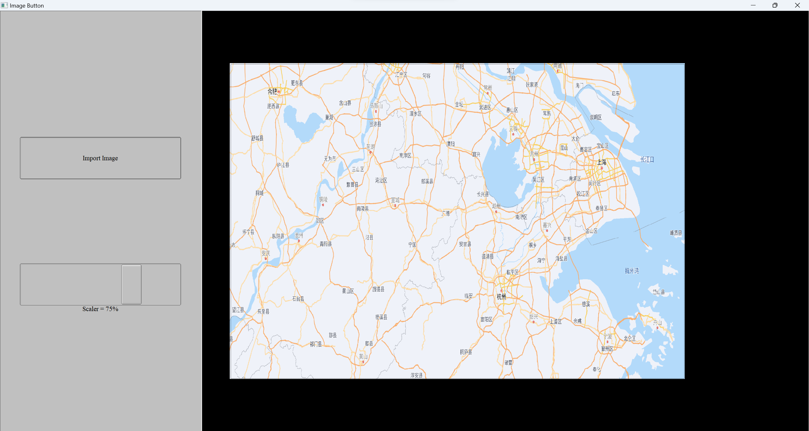
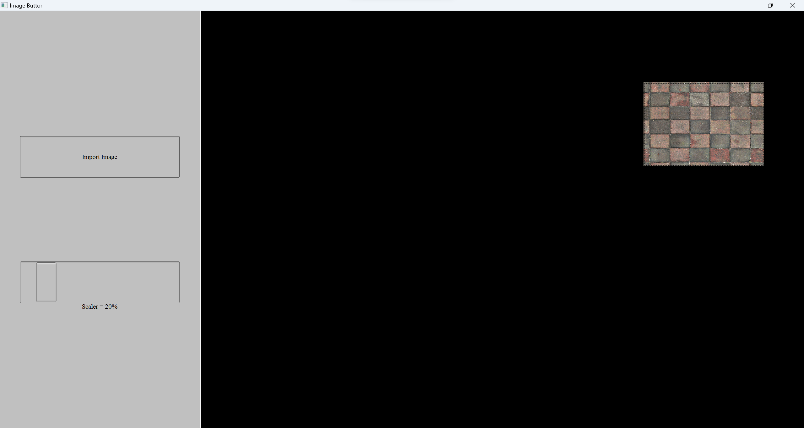

# Image Button

## Introduction

The program provides a button with an image. The button, when clicked, randomly moves to a new position within the window. Additionally, the program includes functionality to import a custom image and adjust the button size with a scaler.

   

## Features

1. **Import Button**: Allow importing image from file. Supported formats are bmp, jpg, ipeg, png, pnm, pbm, pgm, ppm. WARNING: image paths must not contain non-ASCII characters.

   

2. **Scaler Slider**: Changes the size of the button in proportion to the image window.

   

3. **Click Image**: Make the button move randomly in the image window.

   
   

# Clock

## Introduction

Just a clock.

   